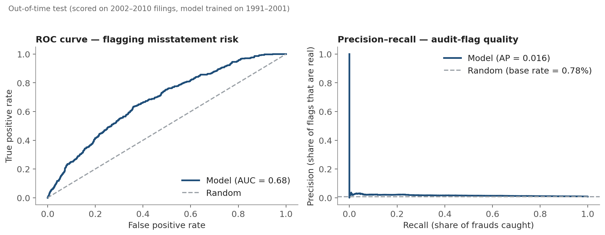
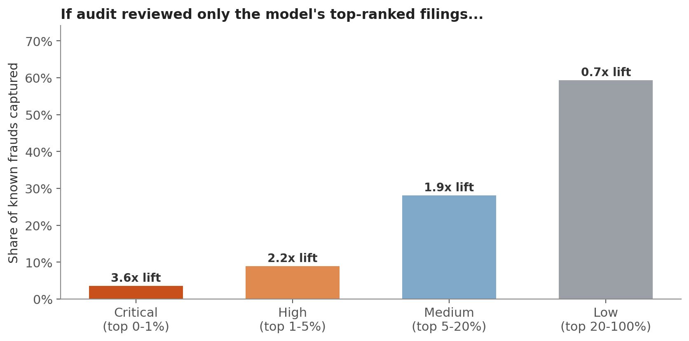
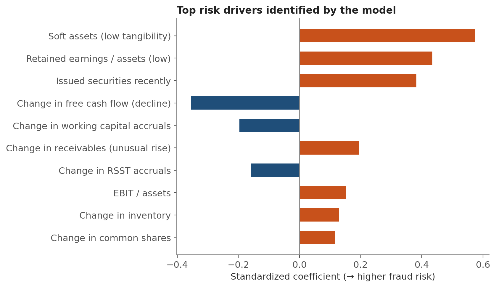

# Financial Statement Fraud Risk-Screening Model

A risk-scoring model that ranks public company filings by fraud likelihood, so a
capacity-constrained internal audit / internal control team can prioritize review
of the highest-risk filings instead of sampling at random.

Built on real SEC enforcement outcomes, not synthetic or self-labeled data:
frauds are firms the SEC formally charged, and the model is scored out-of-time
(trained on the past, tested on unseen future filings) to reflect how a
monitoring model is actually used.

**[Full write-up (PDF)](reports/An_Chu_Project_FinancialStatementRiskModel.pdf)**

---

## Results at a glance

| Metric | Result |
|---|---|
| ROC-AUC (out-of-time test, 2002–2010) | 0.68 |
| Top 1% of filings by risk score capture | **3.6x** the frauds random sampling would |
| Top 5% of filings by risk score capture | **2.2x** the frauds random sampling would |



If an audit team could only review the top-ranked slice of filings each period,
here's how much of the actual fraud they'd catch at each tier:



The strongest risk drivers line up with classic forensic-accounting red flags —
soft-asset intensity, thin retained earnings, recent securities issuance, and
declining free cash flow — which is a useful sanity check that the model learned
something real rather than noise:



---

## Why this project

This started as prep for internal-control / risk-analytics interviews: the job
is fundamentally about knowing where to look when you can't look everywhere.
Rather than a toy classifier on a clean Kaggle dataset, I wanted a problem with
the properties real risk work actually has — severe class imbalance, a label
that's noisy and lagged (not every fraud has been caught yet), and a genuine
"where do we spend our limited review capacity" decision at the end of it.

## Data source

**Bao, Y., Ke, B., Li, B., Yu, J., & Zhang, J. (2020).** *Detecting Accounting
Fraud in Publicly Traded U.S. Firms Using a Machine Learning Approach.*
Journal of Accounting Research, 58(1), 199–235.

The dataset pairs Compustat financial-statement data for U.S. public companies
(fiscal years 1991–2014) with fraud labels drawn from actual **SEC Accounting
and Auditing Enforcement Releases (AAERs)** — i.e., firms the SEC formally
charged with financial-statement fraud. It contains 146,045 firm-year
observations with a genuine, highly imbalanced fraud rate (~0.7% overall).
Publicly available at [github.com/JarFraud/FraudDetection](https://github.com/JarFraud/FraudDetection).

## Methodology

- **Data-quality control:** AAERs are typically filed years after the
  misstated fiscal year, so the most recent years in any snapshot are
  under-labeled — frauds that will eventually be charged still look "clean."
  Fiscal years after 2010 are excluded from evaluation for this reason.
- **Out-of-time validation:** trained on fiscal years 1991–2001, evaluated on
  unseen future years (2002–2010). A random train/test split would leak future
  information and overstate performance; this mirrors real deployment — score
  filings you haven't seen yet.
- **Features:** 14 forensic-accounting ratios from the misstatement-prediction
  literature (e.g., change in receivables, change in free cash flow, soft-asset
  intensity, RSST accruals) rather than raw financials, so values are
  comparable across companies of different sizes.
- **Models:** logistic regression with balanced class weights (interpretable
  coefficients double as a risk-driver ranking) and a random forest as a
  non-linear robustness check. Evaluated on ROC-AUC, precision-recall AUC, and
  capture rate by review-priority tier — plain accuracy is meaningless here
  (99.3% "accuracy" from flagging nothing).

## Repository structure

```
fraud-risk-screening/
├── README.md
├── requirements.txt
├── LICENSE
├── data/
│   ├── download_data.sh        # pulls the raw CSV from the original source
│   └── (data_FraudDetection_JAR2020.csv goes here, not committed)
├── src/
│   ├── 01_explore.py           # class balance, missingness checks
│   ├── 02_train_model.py       # feature prep, temporal split, model training + eval
│   └── 03_generate_figures.py  # ROC/PR curves, tier-capture chart, driver chart
├── outputs/                    # model artifacts + scored test set (generated)
├── figures/                    # chart PNGs (generated, also committed for the README)
└── reports/
    └── An_Chu_Project_FinancialStatementRiskModel.pdf
```

## Reproducing this

```bash
git clone <this-repo>
cd fraud-risk-screening
pip install -r requirements.txt

bash data/download_data.sh          # fetch the raw dataset (~48MB)
python src/01_explore.py            # optional: sanity-check the data
python src/02_train_model.py        # train + evaluate, writes outputs/
python src/03_generate_figures.py   # writes figures/
```

## Limitations & next steps

- Fraud labels depend on SEC enforcement actually being pursued and filed —
  the model is calibrated against *discovered* fraud, a known bound
  acknowledged in the source literature. Some frauds in the "clean" class are
  simply undetected.
- Next: layer in industry and auditor-level features, try a boosted-tree model
  closer to the original paper's RUSBoost approach on the full 28 raw
  variables, and validate tier thresholds against a realistic review-capacity
  constraint (e.g., "we can review 50 filings a quarter") instead of a flat
  percentage.

## License

Code in this repository is MIT-licensed (see [LICENSE](LICENSE)). The
underlying dataset belongs to its original authors — cite Bao et al. (2020) if
you use it.
